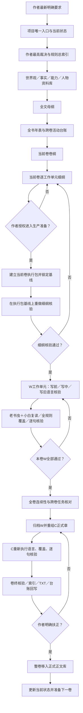

# 通用文件链路图

## 各层只负责自己的问题

| 层 | 回答的问题 | 不能代替 |
|---|---|---|
| 作者裁决 | 哪些内容必须如此、绝不能如何 | 事实核查、正文质量 |
| 规则库 | 写作时必须判断什么 | 对当前文本作出实际判断 |
| 母纲／年表／台账 | 全书去哪、什么时候发生、长线怎样接力 | 当前卷场景细节 |
| 卷纲 | 本卷主问题、高潮和不可逆结果 | 逐工作单元动作链 |
| 细纲 | 谁在何时何地做什么、为什么、造成什么 | 正文语言和阅读体验 |
| 全规则覆盖卡 | 所有规则是否逐份判断 | 逐句语义核验 |
| 逐句表 | 每句话触发了什么规则、是否自然有效 | 全卷连续性 |
| 卷终卡 | 全卷能否交付 | 作者扶正 |

任何一层出现`待核、待填、需改、阻断、TX待作者裁决`，下游不得假装已经放行。

## 文件关联

- 上游依据：[模板库唯一入口](README_唯一入口.md)、[通用模板库完整交接文档](10_通用模板库完整交接文档.md)、[新小说初始化顺序](01_新小说初始化顺序.md)。
- 同层互证：[每卷严格生产流程](03_每卷严格生产流程.md)、[逐卷写作与验收细则](04_逐卷写作与验收细则.md)。
- 下游使用：[写作模板总索引](../04_写作模板库/00_写作模板总索引.md)、[核验模板索引](../06_核验模板库/README_核验模板索引.md)和具体项目链路导航。
- 链路变化后回写：流程图、模板关联字段、核验门禁和项目副本。
