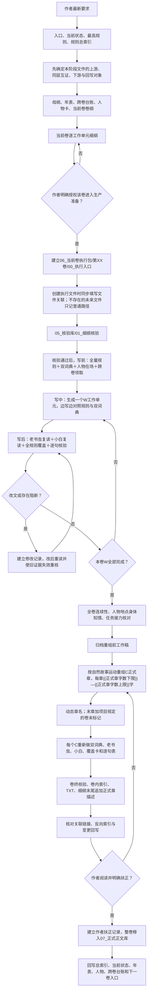

# 全卷正文生产流程图与文档核验卡执行手册

> 唯一适用根目录：`{{项目根目录}}`  
> 本手册规定每一卷何时创建什么文件、放在哪里、读哪些文件、由什么证据放行。  
> 本文件复制进具体项目后执行；项目当前卷、停止点和授权状态必须以该项目`当前工作状态.md`为准。

## 一、总流程



## 二、当前卷固定目录

只有作者明确授权后，才创建下列目录。`02_写作库/06_当前卷执行包`同时只能有一个卷。

```text
02_写作库/06_当前卷执行包/第XX卷_卷名/
├─00_第XX卷执行入口.md
├─01_工作单元/
│  └─WXXX_工作名.md
├─02_正式章节/
│  └─第XXX章_动态章名.md
├─03_重组前工作稿/
│  └─YYYYMMDD_HHMM/
├─04_卷内索引/
│  └─第XX卷_卷内索引.md
└─05_TXT/
   └─第XX卷_卷名.txt
```

核验证据与正文分开：

```text
05_核验库/
├─00_核验模板/
├─01_细纲核验/第XX卷_卷名/
├─02_全规则覆盖/第XX卷_卷名/
├─03_逐句核验/第XX卷_卷名/
├─04_修改记录/第XX卷_卷名/
├─05_卷终核验/第XX卷_卷名/
└─06_作者扶正记录/第XX卷_卷名/
```

## 三、阶段、输入、输出和闸门

以下每一行凡“生成或更新”文件，都必须在同一次操作中填写该文件的语义关联。非正文文件使用`## 文件关联`；W工作单元和C正式章使用文件首部YAML。格式见[文件关联区模板](../04_写作模板库/18_文件关联区模板.md)，硬门见[版本存证TXT与索引同步规则](../01_通用规则库/09_版本存证TXT与索引同步规则.md)。只建立物理文件夹节点或只在目录里出现，不能算完成关联。

| 阶段 | 必须读取 | 必须生成或更新 | 放行条件 |
|---|---|---|---|
| 1. 选定当前卷 | `README_唯一入口`、`当前工作状态`、最高规则、规则总索引 | 不生成正文 | 当前卷与停止点无冲突 |
| 2. 卷纲确认 | 母纲、年表、跨卷台账、人物卡 | `02_写作库/04_卷纲/第XX卷_卷名.md` | 作者未提出新冲突 |
| 3. 细纲编制 | 卷纲、人物卡、规则、研究资料 | `02_写作库/05_细纲/第XX卷_卷名.md` | 每个工作单元都有时空、人物、因果和接口 |
| 4. 作者授权并建立执行入口 | 作者明确授权该卷进入生产准备、当前工作状态 | `.../00_第XX卷执行入口.md`和固定子目录 | 入口记录授权原话、基线SHA、允许范围和“细纲核验前禁写正文” |
| 5. 细纲核验 | 细纲、卷纲、年表、人物卡、全部规则、执行入口 | `05_核验库/01_细纲核验/第XX卷_卷名/` | 无待决和阻断，才可进入W写前准备 |
| 6. 写前准备 | 全部规则、双词典、当前工作单元细纲、人物卡、上一单元状态 | W写前覆盖卡中的写前区、人物在场表、物件与任务领取 | 读完并登记，不得只写“已读” |
| 7. 写中生成W | 同上，双词典保持打开 | `.../01_工作单元/WXXX_工作名.md` | 按故事完整性写，不设W字数上下限 |
| 8. W读者复读 | 当前W最终全文 | 老书虫结论、小白结论 | 卡顿、解释欲、AI腔和信息缺口已处理 |
| 9. W规则核验 | 当前W、全部规则、双词典 | `05_核验库/02_全规则覆盖/.../WXXX_全规则覆盖卡.md`；`03_逐句核验/.../WXXX_逐句核验表.md` | 每句人工判断；SHA与最终文本一致 |
| 10. W修改 | 问题句、对应规则 | 实际改字时建立`04_修改记录/.../WXXX_修改记录.md` | 改后重新全文复读、覆盖和逐句核验 |
| 11. 每五单元复盘 | 本批W、人物与物件状态 | 批次连续性记录并入执行入口或卷终准备记录 | 相邻单元无断裂和重复首次出现 |
| 12. 全卷连续性 | 全部W、卷纲、细纲、年表、人物卡、跨卷台账 | `05_核验库/05_卷终核验/.../全卷连续性与重组核对记录.md` | 时间、地点、身体、知情、任务与伏笔闭合 |
| 13. 重组前存档 | 全部最终W | `.../03_重组前工作稿/YYYYMMDD_HHMM/`和SHA清单 | 存档可回查，不能覆盖 |
| 14. 正式章重组 | 全卷工作稿、连续性记录 | `.../02_正式章节/第XXX章_动态章名.md` | 先按自然章界，再使每章有效正文{{正式章字数下限}}—{{正式章字数上限}}字 |
| 15. 正式章描述 | 正式章与来源W映射 | 在原细纲末尾追加“全卷重组后的正式章节描述” | 只能追加，原细纲正文不删除不覆盖 |
| 16. C独立核验 | 每个C全文、全部规则、双词典 | `CXXX_全规则覆盖卡`、`CXXX_逐句核验表`、必要的`CXXX_修改记录` | 不得复制W结论；改字后重新核验 |
| 17. 卷终交付 | 全部C与核验文件 | 卷规则核验卡、卷终总卡、卷内索引、TXT | 文件数、标题、字数、SHA、语义关联和链接一致 |
| 18. 作者扶正 | 整卷正式章和卷终材料 | `05_核验库/06_作者扶正记录/.../第XX卷_作者扶正记录.md` | 必须有作者明确指令 |
| 19. 入正式库 | 扶正记录 | 整卷从`06_当前卷执行包`移至`07_正式正文库` | 不保留两个现行副本 |
| 20. 卷后回写 | 扶正卷、人物变化、跨卷任务 | 项目索引、当前状态、年表、人物卡、跨卷台账、下一卷入口 | 回写完成后才可准备下一卷 |

## 四、文件关联的全过程硬门

1. **写前确定关系**：先列本次新文件的上游依据、同层互证、下游接收和变更回写，不得写完后再凭印象补。
2. **写中同步落盘**：非正文在文末填写`## 文件关联`；W／C正文在首部YAML登记卷纲、细纲、执行入口、来源W、前后正文、人物卡、任务卡和核验证据。
3. **写后核链接**：只给真实存在的文件建立链接；尚未创建的下游以`待创建：普通文字路径`登记，文件创建后再改成链接。
4. **补反向入口**：新文件至少要被上游索引或接收文件链接一次；只从自己单向指出去、无人能够从业务入口找到它，也不算完整。
5. **改名移动重核**：改名、移动、拆分、合并或内容变更时，同步修改上下游链接、索引、TXT来源映射和受影响核验卡。
6. **交付门禁**：卷终卡必须记录语义关联完整性和断链数；未填关联、存在假链接或遗漏回写均阻断交付。

目录树回答“放在哪里”，文件关联回答“为什么存在、依据什么、交给谁”。两者缺一不可。

## 五、语言规则的四次强制调用

每次都必须同时打开并实际参照：

1. `01_规则库/07_语言与风格/00_双词典强制调用说明.md`
2. `01_规则库/07_语言与风格/01_对白去AI官方腔词典.md`
3. `01_规则库/07_语言与风格/02_旁白去AI官方腔词典.md`

| 时间点 | 检查重点 | 证据位置 |
|---|---|---|
| W写前 | 人物称呼、语气词、中文母语语序、对白长度、旁白禁区 | W全规则覆盖卡的写前区 |
| W写中 | 当前场景每段对白和旁白是否滑入公文腔、审讯腔、翻译腔 | W覆盖卡写中记录；实际改字写W修改记录 |
| W成稿后 | 老书虫与小白完整复读，再做对白、旁白专项审读 | W覆盖卡＋W逐句表 |
| C重组后 | 正式章章界变化后重新从标题到末字独立审读 | C覆盖卡＋C逐句表＋必要的C修改记录 |

工作单元写完后，先退出写作者视角完整阅读，再看规则答案。不能边写边自检后就声称完成独立复读。

## 六、全规则覆盖卡的真实作用

- 每个W、每个C和卷终均须单独建立覆盖卡。
- 覆盖清单以`01_规则库/10_项目规则总索引.md`当前登记为准；规则文件增删后，模板和未完成的覆盖卡必须同步。
- 每份规则都要写当前SHA、是否从首行读到末行、当前对象适用或不适用的具体原因、正文或台账证据。
- “上章不适用”“同卷已核”“脚本无报错”都不能代替本对象判断。
- 覆盖卡不能代替逐句表；逐句表不能代替全卷连续性；三者都不能代替作者扶正。

## 七、逐句核验与改文失效

1. 机器可生成句号、源行、文本和SHA骨架，但人物、触发规则、判断与结论必须人工逐句填写。
2. 任一正文改字后，旧SHA和受影响证据立即失效。
3. 实际改字才建立修改记录；没有修改不得虚构记录。
4. 修改记录必须含修改前、修改后、触发规则、修改原因、连锁影响和改后复读结果。
5. 改后再次改变文本，保留上一轮记录并增加新一轮，不能只留最后版本。

## 八、正式章和动态标题

- W工作单元不受{{正式章字数下限}}—{{正式章字数上限}}字限制。
- 全卷故事写完并核对连续性后，才按自然故事运动重组C正式章。
- 每个C有效正文必须为{{正式章字数下限}}—{{正式章字数上限}}字；不能为凑字数重复解释或硬切动作。
- 正式章内容确定后拟3—5个章名候选，选最贴近实际动作、物件、冲突或反差的一个。
- 每卷最后一章标题末尾必须加`{{卷末标记}}`。
- 标题变化后同步正式章文件名、章首、卷内索引、核验链接和细纲追加区；重组前工作稿文件名不改。

## 九、工具边界

`06_工具/脚本`中的脚本只能辅助生成TXT、计算哈希、检查链接、生成空白核验表和做格式扫描。脚本不得：

- 自动认定规则适用或通过；
- 批量填充逐句结论；
- 替代老书虫和小白全文阅读；
- 自动创建未经作者授权的正文；
- 从`99_迁移与历史`或旧项目恢复已删除正文。

## 十、项目当前执行说明

- 新项目初始化时，`02_写作库/06_当前卷执行包`和`07_正式正文库`都应为空。
- 每次开工前必须在项目`当前工作状态.md`写清当前卷、停止点、已授权范围和禁止动作。
- 本模板库不保存任何具体小说的授权状态，也不能替作者发出正文生成命令。

## 十一、文件关联

- 上游依据：[唯一入口](README_唯一入口.md)、[通用模板库完整交接文档](10_通用模板库完整交接文档.md)、[新小说初始化顺序](01_新小说初始化顺序.md)、[通用规则总索引](../01_通用规则库/00_规则总索引.md)。
- 同层互证：[逐卷写作与验收细则](04_逐卷写作与验收细则.md)、[文件关联区模板](../04_写作模板库/18_文件关联区模板.md)、[核验模板索引](../06_核验模板库/README_核验模板索引.md)。
- 下游使用：具体项目复制后的全卷生产流程、当前卷执行入口及各阶段文件。
- 变更回写：阶段、目录、模板或关联字段变化后，同步初始化顺序、资产清单和具体项目副本。
