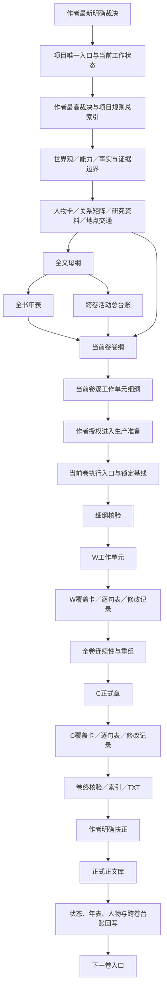
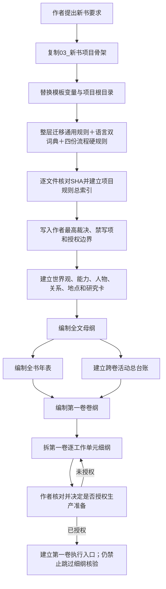
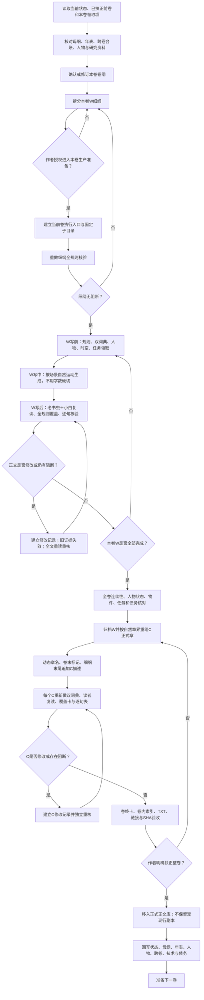
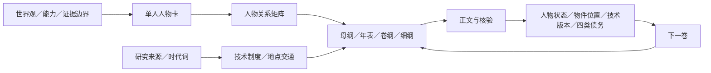
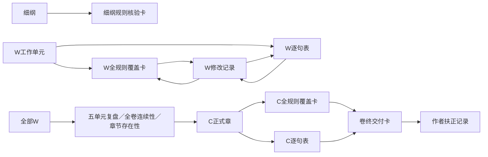
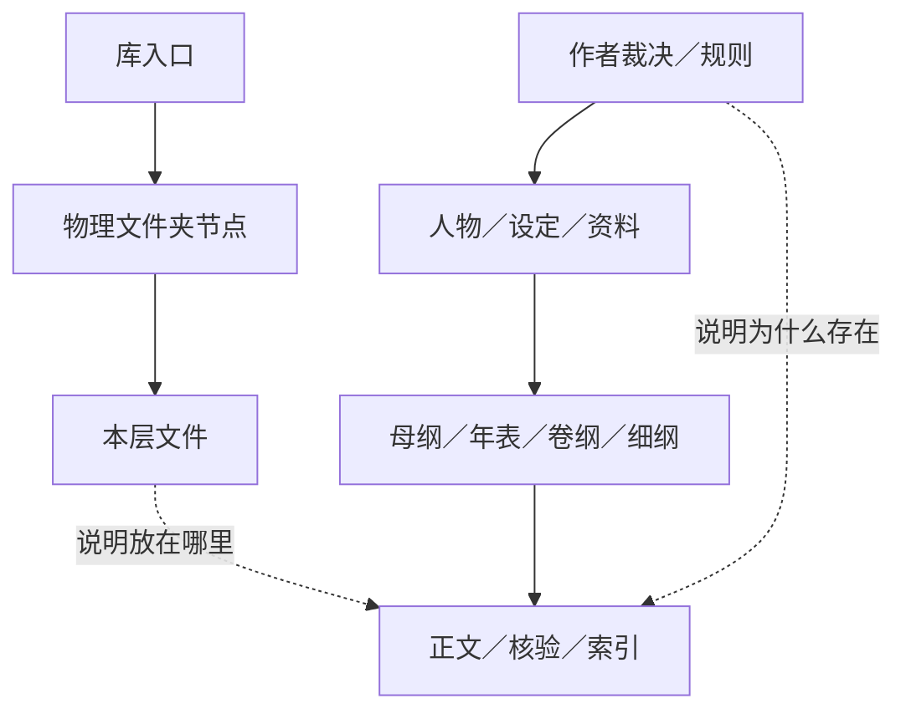

# 通用模板库完整交接文档

> 模板库根目录：`{{模板库根目录}}`  
> 交接用途：让任何新窗口在不依赖旧聊天记录的情况下，知道从哪里进入、该读什么、文件为什么相连、每个阶段生成什么、怎样逐卷推进到结局。  
> 权限边界：阅读本文件不等于获得生成母纲、细纲或正文的授权。作者没有明确下达当前阶段任务时，只能核对和报告，不得自行越级生产。

## 一、先看结论

这套模板库不是一本小说，也不是把若干模板堆在同一个文件夹里。它由四条同时生效的链组成：

1. **权威链**：作者最新明确裁决 → 项目最高规则 → 规则总索引 → 设定、人物和资料 → 纲线 → 正文 → 核验 → 作者扶正。
2. **生产链**：全文母纲 → 全书年表 → 跨卷活动台账 → 当前卷卷纲 → 当前卷细纲 → 当前卷执行包 → W工作单元 → C正式章 → 卷终交付 → 下一卷。
3. **证据链**：被核对象 → 全规则覆盖卡 → 逐句核验表 → 修改记录 → 重核结果 → 卷终卡 → 作者扶正记录。
4. **导航链**：Obsidian库入口 → 顶层物理文件夹节点 → 子文件夹节点 → 本层文件；文件内部再用真实Markdown链接表达业务关系。

四条链缺一不可。文件在文件夹里，只能证明“放在这里”；文件互相有真实链接，才能证明“为什么存在、依据什么、交给谁、变化后回写哪里”。

## 二、新窗口固定进入顺序

新窗口不得凭聊天摘要或旧窗口记忆直接开始工作，必须依次完成：

若由Codex或其他AI技能触发，根目录[SKILL执行入口](../SKILL.md)只提供防偷步、自检和阶段路由；磁盘文件的第一阅读仍是下面第1项唯一入口，Skill不能代替规则全文。

1. 阅读[模板库唯一入口](README_唯一入口.md)，确认这是一套通用结构，不是具体项目。
2. 阅读本交接文档，理解全库层级、关系和逐卷循环。
3. 阅读[新小说初始化顺序](01_新小说初始化顺序.md)，判断当前任务是“新建项目”还是“继续既有项目”。
4. 阅读[通用文件链路图](02_通用文件链路图.md)，确认当前工作位于哪一层。
5. 阅读[通用规则总索引](../01_通用规则库/00_规则总索引.md)，按索引从首行到末行读取全部已登记规则。
6. 若进入具体项目，再读取该项目的唯一入口、当前工作状态、作者最高裁决和项目规则总索引；模板库不能代替项目现状。
7. 若准备某一卷，完整阅读[每卷严格生产流程](03_每卷严格生产流程.md)和[逐卷写作与验收细则](04_逐卷写作与验收细则.md)。
8. 写前、写中和写后都同时参照[双词典强制调用说明](../02_语言与风格库/00_双词典强制调用说明.md)、[对白词典](../02_语言与风格库/01_对白去AI官方腔词典.md)与[旁白词典](../02_语言与风格库/02_旁白去AI官方腔词典.md)。
9. 需要创建文件时，从[写作模板总索引](../04_写作模板库/00_写作模板总索引.md)、[人物与设定模板索引](../05_人物与设定模板库/00_人物与设定模板索引.md)或[核验模板索引](../06_核验模板库/README_核验模板索引.md)选择对应模板，不得用一个文件兼任多个层级。
10. 新窗口先填写项目化后的“新窗口基线读取回执”；没有确认当前卷、停止点、授权范围和禁做项，不得开始生产。

若只是查询、讨论、核对、规划或整理资料，停在相应层即可。不要因为已经读到生产流程，就自行创建执行包或正文。

## 三、模板库的物理层与职责

| 物理位置 | 人工入口 | 负责什么 | 主要下游 | 不能代替什么 |
|---|---|---|---|---|
| 根目录 | [SKILL执行入口](../SKILL.md)、[Obsidian库入口](../OBSIDIAN_库入口.md) | AI防偷步与阶段路由、整库入口和Obsidian顶层导航 | 模板库唯一入口、各顶层文件夹节点 | 规则全文、授权、正文判断 |
| `00_模板库入口` | [模板库唯一入口](README_唯一入口.md) | 使用顺序、完整交接、文件链路、逐卷流程、资产与缺口 | 新项目初始化和每卷执行 | 项目专属事实与作者裁决 |
| `00_Obsidian导航` | [全库文件直链索引](../00_Obsidian导航/01_全库文件直链索引.md) | 物理目录树、文件夹节点、全文件直链 | Obsidian文件浏览与关系图 | 业务语义关系 |
| `01_通用规则库` | [规则总索引](../01_通用规则库/00_规则总索引.md) | 所有小说都要逐对象判断的通用规则 | 项目规则库、全规则覆盖卡 | 对某段文本作出实际结论 |
| `02_语言与风格库` | [双词典强制调用说明](../02_语言与风格库/00_双词典强制调用说明.md) | 中文母语语序、对白自然度、旁白去AI腔 | W、C、逐句表、修改记录 | 人物专属声线和项目时代词 |
| `03_新书项目骨架` | [骨架项目唯一入口](../03_新书项目骨架/00_项目入口/README_唯一入口.md) | 新项目的空目录、入口、规则、写作、核验和历史层 | 新小说项目根目录 | 已完成的母纲、人物卡和正文 |
| `04_写作模板库` | [写作模板总索引](../04_写作模板库/00_写作模板总索引.md) | 状态、母纲、年表、跨卷、卷纲、细纲、执行、任务卡、回写 | 项目写作库 | 具体小说内容和授权状态 |
| `05_人物与设定模板库` | [人物与设定模板索引](../05_人物与设定模板库/00_人物与设定模板索引.md) | 人物、关系、世界、能力、研究、地点、技术和状态台账 | 母纲、年表、卷纲、细纲、核验 | 作者对人物命运的最终决定 |
| `06_核验模板库` | [核验模板索引](../06_核验模板库/README_核验模板索引.md) | 初始化、基线、细纲、W、C、逐句、修改、卷终和扶正证据 | 下一道生产闸门 | 人工阅读和作者扶正 |
| `07_工具脚本` | [工具边界与用法](../07_工具脚本/README_工具边界与用法.md) | 哈希、空表、TXT、重组、目录树和关联缺口的机械辅助 | 机械验收报告 | 语义判断、审美判断、写作授权 |
| `99_来源与维护` | [来源与维护说明](../99_来源与维护/README_来源与维护.md) | 来源映射、文件去向、SHA清单和模板库验收 | 升级、审计、追溯 | 日常创作入口 |
| `.obsidian` | 由Obsidian维护 | 本机库配置、外观、关系图和工作区状态 | Obsidian应用 | 内容资产；不进入内容SHA清单 |

完整物理文件名以[全库文件直链索引](../00_Obsidian导航/01_全库文件直链索引.md)为人工入口，以[通用模板库文件清单](../99_来源与维护/通用模板库文件清单.tsv)为逐文件路径、长度和SHA证据，以[完整资产登记与缺口清单](09_完整资产登记与缺口清单.md)为职责级登记。三者分别回答“怎么打开”“文件是否存在”“为什么需要”。

## 四、全库权威链



任何下游文件只能依据真实存在、当前有效的上游版本。作者更改高层事实后，不能只改细纲或正文，必须沿箭头向下做影响检查；正文、规则或细纲发生变更后，相关核验SHA立即失效。

## 五、项目初始化到允许准备第一卷



初始化时对应的关键证据如下：

| 阶段 | 模板或入口 | 项目内产物 | 放行证据 |
|---|---|---|---|
| 建目录 | [新小说初始化顺序](01_新小说初始化顺序.md)、[骨架项目](../03_新书项目骨架/00_项目入口/README_唯一入口.md) | 项目根目录和固定层级 | [新项目初始化验收卡模板](../06_核验模板库/10_新项目初始化验收卡模板.md) |
| 迁规则 | [通用规则总索引](../01_通用规则库/00_规则总索引.md)、[资产清单](08_通用资产清单.md) | 项目规则库、语言库、规则总索引 | 逐文件SHA和迁移验收 |
| 锁作者裁决 | [作者裁决与优先级](../01_通用规则库/01_作者裁决与规则优先级.md) | `00_作者最高裁决.md`、当前工作状态 | 作者原话和生效日期 |
| 建人物设定 | [人物与设定模板索引](../05_人物与设定模板库/00_人物与设定模板索引.md) | 人物卡、关系、世界、资料与各专账 | 无未裁决冲突 |
| 建全书骨架 | [全文母纲模板](../04_写作模板库/02_全文母纲模板.md)、[年表模板](../04_写作模板库/03_全书年表模板.md)、[跨卷台账模板](../04_写作模板库/04_跨卷活动总台账模板.md) | 母纲、年表、跨卷台账 | 三者互相一致 |
| 建第一卷 | [卷纲模板](../04_写作模板库/05_逐卷卷纲模板.md)、[细纲模板](../04_写作模板库/06_逐工作单元细纲模板.md) | 第一卷卷纲与W细纲 | 作者授权只能放行到执行入口 |

## 六、每一卷的固定生产循环



### 6.1 当前卷的文件位置

作者明确授权后，具体项目才建立：

```text
02_写作库/06_当前卷执行包/第XX卷_卷名/
├─00_第XX卷执行入口.md
├─01_工作单元/
│  └─WXXX_工作名.md
├─02_正式章节/
│  └─第XXX章_动态章名.md
├─03_重组前工作稿/
│  └─YYYYMMDD_HHMM/
├─04_卷内索引/
│  └─第XX卷_卷内索引.md
└─05_TXT/
   └─第XX卷_卷名.txt
```

核验证据单独存放：

```text
05_核验库/
├─01_细纲核验/第XX卷_卷名/
├─02_全规则覆盖/第XX卷_卷名/
├─03_逐句核验/第XX卷_卷名/
├─04_修改记录/第XX卷_卷名/
├─05_卷终核验/第XX卷_卷名/
└─06_作者扶正记录/第XX卷_卷名/
```

### 6.2 当前卷各阶段的输入、产物和闸门

| 阶段 | 必须读取 | 必须生成或更新 | 闸门 |
|---|---|---|---|
| 选卷 | 项目唯一入口、当前状态、已扶正前卷 | 不生成正文 | 当前卷和停止点唯一 |
| 卷纲 | 母纲、年表、跨卷台账、人物与资料 | `04_卷纲/第XX卷_*.md` | 主问题、高潮、不可逆结果清楚 |
| 细纲 | 卷纲、规则、人物、研究与上卷状态 | `05_细纲/第XX卷_*.md` | 每个W有时空、人物、欲望、因果和接口 |
| 授权 | 作者明确原话、当前状态 | 当前卷执行入口 | 只授权准备，不等于允许跳过细纲核验 |
| 细纲核验 | 细纲及全部上游 | 细纲规则核验卡 | 无`待决／需改／阻断` |
| W写前 | 全量规则、四份流程硬规则、双词典、人物、卷纲细纲、上一个W状态 | `02_全规则覆盖/第XX卷_卷名/工作单元WXXX_全规则覆盖卡.md`写前区 | 路径、SHA、在场／身体／知情、物件任务、语言风险和回写对象全部登记，不只写“已读” |
| W写中 | 当前W细纲、写前约束和双词典 | `01_工作单元/WXXX_工作名.md`及同一覆盖卡写中区 | 完整场景运动，不用字数凑章；缺写中记录只能算草稿 |
| W写后 | W最终全文、全部规则、双词典和逐句规则 | 同一覆盖卡写后区、`03_逐句核验/.../工作单元WXXX_工作名_逐句核验表.md`、必要修改记录、章后回写 | 老书虫、小白、双词典、逐句判断、最终SHA和回写一致 |
| W改文 | 问题句和触发规则 | W修改记录 | 改后旧证据失效并全量重核 |
| 卷中复盘 | 每五个W及各状态台账 | `05_卷终核验/.../每五工作单元WXXX-WXXX_连续性复盘.md` | 无重复首次出现、瞬移和状态断裂；缺卡不得继续下一批W |
| 全卷核对 | 全部W和上游资料 | 全卷连续性记录、章节存在性卡 | 时间、地点、知情、任务和债务闭合 |
| 存档重组 | 最终W | 时间戳存档、段落映射、C正式章 | 原W可追溯，不覆盖 |
| C核验 | 每个C、全部规则、双词典 | C覆盖卡、C逐句表、必要的修改记录 | 不能继承W结论 |
| 卷终交付 | 全部C和核验证据 | 卷覆盖总卡、全卷连续性与重组记录、全卷连续性与规则总核验表、卷规则核验卡、卷终交付核验卡、卷内索引、TXT、细纲追加区 | 数量、标题、字数、SHA、语义关联、反向入口和链接一致 |
| 扶正 | 整卷交付物 | 作者扶正记录 | 必须有作者明确确认 |
| 入正式库 | 扶正记录 | 正式正文库中的本卷 | 不留两个现行副本 |
| 卷后回写 | 扶正卷和全部变化 | 当前状态、年表、人物、台账、下一卷入口 | 回写完成才准备下一卷 |

本节只作交接摘要，精确文件名、固定目录和完整读取清单以[每卷严格生产流程第三节](03_每卷严格生产流程.md#三阶段输入输出和闸门)为准。任一必需文件不存在、放错目录、命名不合规、为空、仍有待核项、SHA不一致、缺业务关联或反向入口，当前W、C或整卷一律禁止提交验收。

## 七、从第一卷一直循环到结局


“逐卷推进”不是把后续卷完全想空，也不是一次写完整本书。正确分工是：

- 母纲先确定全书方向、终局承诺和大阶段；
- 年表先锁关键时间和不能冲突的年龄、季节、任务周期；
- 跨卷台账先登记会持续多卷的A／B／C／D活动；
- 后续卷可以有卷级骨架，但只把当前获准卷拆到可写细度；
- 每卷扶正后，用真实结果修正下一卷，不能把旧骨架当不可更改事实；
- 作者若修改已扶正上游事实，暂停受影响后续卷，先做事实变更连锁检查，再逐层回写。

### 7.1 卷间交接必须携带的内容

从第X卷进入第X+1卷前，至少交接：

1. 第X卷作者扶正记录和正式正文SHA；
2. 卷末精确时间、地点、人物年龄、身体、关系、知情和权限；
3. 未完成A／B／C／D活动及最迟下次镜头；
4. 伏笔、敌手、制度、技术试验和资源状态；
5. 人物状态、物件证据位置、技术制度版本和四类债务；
6. 已改变的母纲、年表、人物卡和研究结论；
7. 下一卷必须接住的第一场事件、不可提前成果和禁止事项。

缺少这份卷间状态包，下一卷不能仅靠上一卷最后几章或聊天摘要开写。

## 八、终局卷与全书收口的额外门禁

终局卷完成普通卷的全部步骤后，还必须通过：

1. **终局承诺核对**：结局是否兑现母纲早期承诺，若改变是否有作者新裁决。
2. **跨卷任务清账**：每条长期活动标明完成、失败、转化、永久开放或明确放弃；不能静默消失。
3. **人物终态**：主要人物的生死、关系、身份、地点、知情、权限和长期选择都有落点。
4. **物件终态**：关键证据、信物、技术样机、账册、武器和资料去向明确。
5. **技术制度终态**：现行版本、适用范围、负责人、维护人、失败边界和后续传承明确。
6. **四类债务终态**：伦理、制度、生态和家庭／关系债务已偿还、转化或被作品明确承认。
7. **时间与编号**：全书卷号、章号、年龄、历时、交通和季节无互相冲突。
8. **标题与卷末标记**：章名取自实际内容；每卷末章有项目规定的卷末标记。
9. **全书索引与TXT**：来源顺序、文件名、章首标题、有效正文和SHA一致。
10. **最终扶正**：卷卷扶正不能自动推导为全书扶正，仍需作者最后一次明确确认。

## 九、模板之间的职责关系

### 9.1 写作层

| 模板 | 生成对象 | 主要上游 | 主要下游／回写 |
|---|---|---|---|
| [当前工作状态模板](../04_写作模板库/01_当前工作状态模板.md) | 当前卷、停止点、权限和下一步 | 作者裁决、扶正记录 | 所有新窗口和执行入口 |
| [全文母纲模板](../04_写作模板库/02_全文母纲模板.md) | 全书目标、大阶段、终局承诺 | 作者裁决、世界与人物 | 年表、跨卷台账、卷纲；卷后回写 |
| [全书年表模板](../04_写作模板库/03_全书年表模板.md) | 时间、年龄、季节和长期事件 | 母纲、人物与资料 | 卷纲、细纲、连续性核验 |
| [跨卷活动总台账模板](../04_写作模板库/04_跨卷活动总台账模板.md) | A／B／C／D长线任务 | 母纲、年表、任务卡 | 各卷领取归还、终局清账 |
| [逐卷卷纲模板](../04_写作模板库/05_逐卷卷纲模板.md) | 本卷主问题、高潮和结果 | 母纲、年表、跨卷、人物 | 细纲和卷终回写 |
| [逐工作单元细纲模板](../04_写作模板库/06_逐工作单元细纲模板.md) | W级场景运动 | 卷纲、人物、规则、研究 | W正文；卷后追加C描述 |
| [当前卷执行入口模板](../04_写作模板库/07_当前卷执行入口模板.md) | 授权、基线SHA和本卷目录 | 作者授权、当前状态、细纲 | W、C和全部核验文件 |
| [卷内索引模板](../04_写作模板库/08_卷内索引模板.md) | C顺序、标题、字数和SHA | 正式章、卷终卡 | TXT和正式正文库 |
| [细纲末尾正式章回写模板](../04_写作模板库/09_细纲末尾正式章回写模板.md) | W到C的最终映射 | C正式章 | 细纲追加区，不覆盖原细纲 |
| [卷终回写清单模板](../04_写作模板库/10_卷终回写清单模板.md) | 卷后全局回写项 | 扶正卷 | 状态、母纲、年表、人物、台账 |
| [七类任务卡](../04_写作模板库/11_ABCD任务领取与归还卡模板.md) | 跨卷、能力、技术、战争、宗教、插镜、敌手行动 | 母纲与专项资料 | 卷纲、细纲、执行记录、终局清账 |
| [文件关联区模板](../04_写作模板库/18_文件关联区模板.md) | 每份文件的业务关系 | 当前对象实际依据 | Obsidian关系图、反向索引、变更回写 |

### 9.2 人物、世界与研究层

[人物与设定模板索引](../05_人物与设定模板库/00_人物与设定模板索引.md)中的16类模板分别负责：单人事实、人物关系、世界规则、能力边界、研究来源、技术制度、地点交通、事实变更、建卡范围、人物导航、反写冲突、时代词、人物状态、物件位置、技术版本和四类债务。

它们不是背景资料仓库，而是纲线和正文的事实上游：



人物卡和纲线冲突时，不能直接让正文替其中一方裁决；应使用[事实变更连锁检查模板](../05_人物与设定模板库/08_事实变更连锁检查模板.md)和[人物卡反写纲线冲突清单](../05_人物与设定模板库/11_人物卡反写纲线冲突清单模板.md)，回到作者层决定。

### 9.3 核验层

核验模板不产生事实，只记录某个版本是否被逐规则、逐句和逐卷检查：



核验卡中的SHA必须指向被核对象的当前版本。改一个字、改标题、拆章、合章、移动文件或改变规则版本，都要判断哪些证据失效；不得沿用“上一版已通过”。

## 十、语言规则在写前、写中、写后的调用

两份词典不是只在成稿后查错，也不是只在写作时凭感觉参照。必须在四个时间点同时调用：

| 时间点 | 同时打开 | 主要判断 | 留证位置 |
|---|---|---|---|
| W写前 | 双词典说明、对白词典、旁白词典 | 称呼、语气词、中文语序、对白长短、旁白禁区 | W覆盖卡写前区 |
| W写中 | 同上 | 公文腔、审讯腔、翻译腔、硬短句、解释性旁白 | W覆盖卡写中区；改字则建修改记录 |
| W写后 | 同上＋W全文 | 老书虫读感、小白可读性、语气词、自然衔接 | W覆盖卡、W逐句表 |
| C重组后 | 同上＋C全文 | 章界变化造成的突兀、复述、前后文缺口 | C覆盖卡、C逐句表、C修改记录 |

同时执行[正文防复发审计清单](05_正文防复发审计清单.md)和[逐句核验与改文失效规则](06_逐句核验与改文失效规则.md)。机器只能生成表格骨架，不能代替读过大量小说的老书虫视角和第一次接触本书的小白视角。

## 十一、Obsidian怎样看文件关系

### 11.1 怎样打开

1. 在Obsidian中把下载或克隆后的仓库根目录作为一个独立库打开。
2. 从根目录[OBSIDIAN_库入口](../OBSIDIAN_库入口.md)进入。
3. 需要按物理目录查找时，打开[全库文件直链索引](../00_Obsidian导航/01_全库文件直链索引.md)或左侧文件浏览器。
4. 需要看关系时，打开Obsidian“关系图谱”；点某个文件，查看它的出链、入链和邻接文件。

### 11.2 什么会自动出现，什么不会

- 只要新文件实际创建在这个Vault根目录内，Obsidian文件浏览器就会自动看见；正文也一样。
- 文件自动出现，不等于自动拥有业务关系。
- 全库索引和“物理文件夹 → 文件”节点由[目录树重建工具](../07_工具脚本/Build-ObsidianVaultIndex.ps1)生成；新增、删除、改名或移动后要重建。
- Obsidian关系图只把真实Markdown链接当作关系。没有链接的两个文件，即使放在相邻文件夹，也不会自动成为业务上下游。
- 脚本不得猜测“这份人物卡应该关联哪一卷”“这条规则影响哪一章”；语义关系必须由创建者按实际内容填写。

### 11.3 文件关联的最低格式

非正文Markdown在文末写：

```markdown
## 文件关联

- 上游依据：真实存在的作者裁决、规则、人物卡、母纲或卷纲链接。
- 同层互证：同一阶段共同证明当前结论的文件链接。
- 下游使用：会读取本文件的细纲、正文、核验或索引链接。
- 变更回写：本文件变化后必须同步检查的文件链接。
```

W工作单元和C正式章使用[文件关联区模板](../04_写作模板库/18_文件关联区模板.md)规定的首部YAML，避免关联文字进入TXT正文。未来文件尚未创建时，只写`待创建：普通文字路径`，不能建立假链接；文件真正创建后，再补真实链接和至少一条反向入口。

### 11.4 新增或调整文件后的固定动作

1. 在新文件内填写业务关联。
2. 在所属业务索引或上游文件中补一条反向链接。
3. 运行[Build-ObsidianVaultIndex.ps1](../07_工具脚本/Build-ObsidianVaultIndex.ps1)，重建物理目录树。
4. 运行[Test-FileAssociations.ps1](../07_工具脚本/Test-FileAssociations.ps1)，只读检查是否缺关联区或本地出链。
5. 修复真实断链，不得用空文件或假链接把数字凑成零。
6. 更新资产登记、来源去向、SHA清单、Obsidian入库记录和验收报告。

因此，Obsidian中应同时存在两种关系：



第一组是目录关系，第二组是业务关系。目录图清楚但业务链缺失，或业务链存在但文件无法从入口找到，都不算交接完整。

## 十二、工具能做什么、不能做什么

| 工具 | 机械用途 | 禁止替代 |
|---|---|---|
| [Initialize-CommonRuleLibrary.ps1](../07_工具脚本/Initialize-CommonRuleLibrary.ps1) | 整层迁移规则并核对SHA | 选择性漏迁规则、改写项目裁决 |
| [Build-ObsidianVaultIndex.ps1](../07_工具脚本/Build-ObsidianVaultIndex.ps1) | 重建物理文件夹节点和全库直链索引 | 猜测业务关系 |
| [Test-FileAssociations.ps1](../07_工具脚本/Test-FileAssociations.ps1) | 统计关联区、出链候选和缺口 | 判断链接是否在语义上正确 |
| [New-SentenceAuditTable.ps1](../07_工具脚本/New-SentenceAuditTable.ps1) | 从正文生成逐句核验表骨架 | 自动填写人物、规则触发和通过结论 |
| [Rebase-SentenceAuditTable.ps1](../07_工具脚本/Rebase-SentenceAuditTable.ps1) | 正文变化后重建句表并保留可核对信息 | 宣称旧核验继续有效 |
| [Test-SentenceAuditTable.ps1](../07_工具脚本/Test-SentenceAuditTable.ps1) | 检查逐句表结构与覆盖 | 代替人工逐句阅读 |
| [Build-FormalVolumeFromParagraphMap.ps1](../07_工具脚本/Build-FormalVolumeFromParagraphMap.ps1) | 按人工段落映射重组C | 自动决定哪里该拆章合章 |
| [Build-FormalVolumeTxt.ps1](../07_工具脚本/Build-FormalVolumeTxt.ps1) | 按索引和来源SHA生成TXT | 判断故事质量或作者扶正 |
| [Build-NovelWritingSkillPackage.ps1](../07_工具脚本/Build-NovelWritingSkillPackage.ps1) | 从已脱敏发行根目录生成Codex或扣子Skill包并校验frontmatter、路径和SHA | 直接打包未脱敏本机库、替代插件结构校验或语义验收 |

## 十三、文件变更时怎样沿链回写

| 发生变化 | 至少检查和回写 |
|---|---|
| 作者新增裁决 | 最高规则、规则总索引、世界／人物／母纲、所有受影响下游 |
| 人物卡事实变化 | 关系矩阵、年表、母纲、跨卷、卷纲、细纲、人物状态和受影响正文 |
| 世界或能力边界变化 | 专项规则、任务卡、技术制度、母纲及全部已依赖文本 |
| 母纲变化 | 年表、跨卷台账、所有未扶正卷纲；已扶正内容单独做影响审计 |
| 卷纲变化 | 当前卷细纲、任务领取、执行入口基线和细纲核验 |
| 细纲变化 | 执行入口SHA、已生成W、覆盖卡和逐句表 |
| W正文变化 | W修改记录、W覆盖卡、W逐句表、连续性和C来源映射 |
| C正文或标题变化 | C修改记录、C覆盖卡、C逐句表、卷内索引、TXT和细纲追加区 |
| 文件改名或移动 | 上下游链接、Obsidian节点、索引、TXT来源映射和SHA清单 |
| 规则文件变化 | 规则总索引、所有未完成覆盖卡；已完成对象判断是否需要重核 |

## 十四、交付与停止条件

### 14.1 单卷交付必须全部满足

- 卷纲和细纲与现行母纲、年表、人物卡一致；
- 作者已经明确授权本卷进入生产准备；
- 细纲核验无阻断；
- 每个W完成写前、写中、写后语言调用、读者复读、覆盖卡和逐句表；
- 每次改文都有真实修改记录且改后重核；
- 全卷连续性和章节存在性通过；
- 每个C独立核验，未继承W结论；
- 卷内索引、标题、卷末标记、TXT和SHA一致；
- 文件业务关联和Obsidian物理导航都可追溯；
- 作者明确扶正后才移入正式正文库；
- 卷后全局回写完成。

### 14.2 出现以下任一情况立即停止下游

- 作者尚未裁决会改变方向的问题；
- 当前工作状态、授权范围或停止点不明；
- 上游文件缺失、版本不明或互相冲突；
- 人物不可能在场、身体不能行动、信息不可能得知；
- 卷纲／细纲有`待决、需改、阻断、TX`；
- 规则未全量读取，双词典未调用；
- 被核对象变更后仍引用旧SHA；
- 文件只有目录归属，没有真实业务关联；
- 旧稿、废稿、历史文件被误当现行基线；
- 作者没有明确扶正，却准备移入正式正文库。

## 十五、模板库维护与当前边界

模板库的结构、数量、链接和脚本状态以[通用模板库验收报告](../99_来源与维护/02_通用模板库验收报告.md)为准；文件来源与是否通用化见[源文件去向总登记](../99_来源与维护/03_源文件去向总登记.md)。

截至2026-08-16本次公开交接验收：公开文件174个；Markdown 158份；物理文件夹节点41个，133个普通文件均已被所属文件夹节点接入；本地Markdown真实链接550条，断链0。语义关联只读扫描排除历史层和机械节点后共有116份现行Markdown，其中68份已有文件关联区，48份是早期存量待补。这个缺口必须如实保留：本交接已经给出所有文件层、文件族和生产阶段的关系，并由全库直链索引覆盖全部物理文件，但不能替那48份存量文件编造并不存在的具体业务上下游。以后实际修改其中任一文件时，应先按真实用途补关联，再交付。

新增、删除、改名或移动模板时，必须同步：

1. 所属目录索引；
2. 本交接文档中受影响的职责和流程；
3. [通用资产清单](08_通用资产清单.md)；
4. [完整资产登记与缺口清单](09_完整资产登记与缺口清单.md)；
5. 来源去向或维护记录；
6. Obsidian目录树与入库记录；
7. 逐文件SHA清单；
8. 模板库验收报告。

模板库只能保证“结构和流程准备好”，不能保证未来任何小说自动写好。具体项目仍需要作者裁决、真实人物和资料、逐卷扶正、人工语言审读与逐句核验。

## 十六、新窗口交接回执

新窗口读完后，必须先向作者报告以下内容，再等待当前任务授权：

```text
已读取的项目／模板库根目录：
当前工作对象：
当前卷或阶段：
最后一个已扶正对象：
作者本轮明确允许的动作：
本轮明确禁止的动作：
必须读取但仍缺失的文件：
当前阻断或待作者裁决：
下一步只准备做什么：
```

没有这份回执，就不能用“我已经了解项目”替代真实基线读取。

## 十七、本文件的文件关联

- 上游依据：[模板库唯一入口](README_唯一入口.md)、[通用文件链路图](02_通用文件链路图.md)、[每卷严格生产流程](03_每卷严格生产流程.md)、[逐卷写作与验收细则](04_逐卷写作与验收细则.md)。
- 同层互证：[通用资产清单](08_通用资产清单.md)、[完整资产登记与缺口清单](09_完整资产登记与缺口清单.md)、[全库文件直链索引](../00_Obsidian导航/01_全库文件直链索引.md)。
- 下游使用：新窗口基线读取、新小说初始化、每卷执行入口、卷间交接和全书终局验收。
- 变更回写：任一层级、目录、流程、模板、核验闸门或Obsidian维护方式变化时，同步更新本文件、唯一入口、资产登记、入库记录、SHA清单和验收报告。
