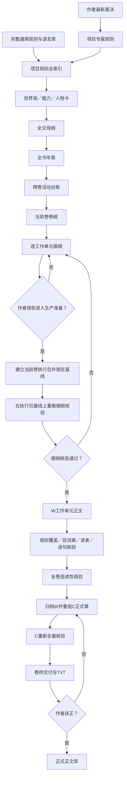

# 项目文件链路图

```mermaid
flowchart TD
    A["作者最新裁决"] --> B["项目专属规则"]
    T["完整通用规则与语言库"] --> R["项目规则总索引"]
    B --> R
    R --> C["世界观／能力／人物卡"]
    C --> D["全文母纲"]
    D --> E["全书年表"]
    E --> F["跨卷活动台账"]
    F --> G["当前卷卷纲"]
    G --> H["逐工作单元细纲"]
    H --> J{"作者授权进入生产准备？"}
    J -- "否" --> H
    J -- "是" --> K["建立当前卷执行包并锁定基线"]
    K --> I["在执行包基线上重做细纲核验"]
    I --> X{"细纲核验通过？"}
    X -- "否" --> H
    X -- "是" --> L["W工作单元正文"]
    L --> M["规则覆盖／双词典／读者／逐句核验"]
    M --> N["全卷连续性核验"]
    N --> O["归档W并重组C正式章"]
    O --> P["C重新全量核验"]
    P --> Q["卷终交付与TXT"]
    Q --> S{"作者扶正？"}
    S -- "否" --> O
    S -- "是" --> U["正式正文库"]
```

任一上游文件改变，下游结论都必须按影响范围重验。
