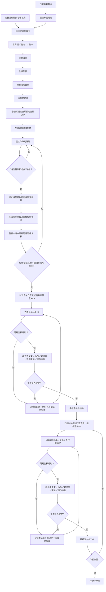

# 项目文件链路图

```mermaid
flowchart TD
    A["作者最新裁决"] --> B["项目专属规则"]
    T["完整通用规则与语言库"] --> R["项目规则总索引"]
    B --> R
    R --> C["世界观／能力／人物卡"]
    C --> D["全文母纲"]
    D --> E["全书年表"]
    E --> F["跨卷活动台账"]
    F --> G["当前卷卷纲"]
    G --> GX["卷纲常规检查并锁定当前SHA"]
    GX --> GY["卷纲周易思维复核"]
    GY --> H["逐工作单元细纲"]
    H --> J{"作者授权进入生产准备？"}
    J -- "否" --> H
    J -- "是" --> K["建立当前卷执行包并锁定基线"]
    K --> I["在执行包基线上重做细纲核验"]
    I --> IY["整卷＋逐W细纲周易思维复核"]
    IY --> X{"细纲常规核验与周易复核均通过？"}
    X -- "否" --> H
    X -- "是" --> L["W工作单元正文成稿并锁候选SHA"]
    L --> WY["W周易正文复核"]
    WY --> WQ{"周易复核通过？"}
    WQ -- "否" --> WL["W修改记录＋新SHA＋旧证据失效"]
    WL --> WY
    WQ -- "是" --> M["老书虫全文→小白／双词典／规则覆盖／逐句核验"]
    M --> MX{"下游是否改文？"}
    MX -- "是" --> WL
    MX -- "否" --> N["全卷连续性核验"]
    N --> O["归档W并重组C正式章，锁候选SHA"]
    O --> CY["C独立周易正文复核；不得继承W"]
    CY --> CQ{"周易复核通过？"}
    CQ -- "否" --> CL["C修改记录＋新SHA＋旧证据失效"]
    CL --> CY
    CQ -- "是" --> P["老书虫全文→小白／双词典／覆盖／逐句核验"]
    P --> PX{"下游是否改文？"}
    PX -- "是" --> CL
    PX -- "否" --> Q["卷终交付与TXT"]
    Q --> S{"作者扶正？"}
    S -- "否" --> O
    S -- "是" --> U["正式正文库"]
```

任一上游文件改变，下游结论都必须按影响范围重验。卷纲／细纲先完成常规核验再做周易复核；W／C正文则先锁候选SHA做周易正文复核，通过后才允许开始老书虫全文章节核验。老书虫及其后任一步改文，都要对新SHA先重做周易，再完整重跑下游核验。
