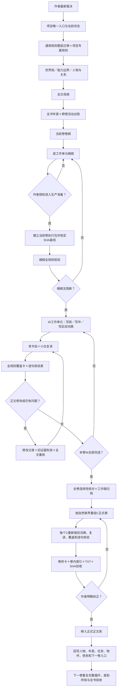

# AI 长篇小说自动审核与编写流程

> 历时三个月，使用了 **100 亿 Token**，写出了 **300 万字废稿**与 **80 万字正文**，在一次次推翻、重写、复读和验收中逐步推进，总算练成了这套长篇小说自动审核与编写流程。

这是一套面向 Codex、Obsidian 和其他文件型 AI 工作环境的长篇小说生产模板库。它把作者裁决、规则、人物设定、母纲、年表、卷纲、工作单元、正式章节、逐句核验、版本存证和作者扶正连接成可追溯流程。

这里的“自动”指流程路由、模板生成、机械检查、文件关联和版本证据可以自动推进；人物是否可信、故事是否好看、文字是否自然以及作品是否扶正，仍必须由作者和人工全文审读决定。

最新版新增AI执行硬闸门：未知项必须先核对，摘要、批量扫描、旧校验卡和并行任务结论不能替代当前对象的逐章逐行语义核验；没有真实文件与可复查证据，不得报告正式完成。

技能与插件的发行安装包，放在【99_来源与维护】中。

## 总流程图



## 它解决什么问题

- 新窗口凭聊天记忆直接续写，导致规则和事实漂移；
- 大纲、工作稿、正式章和合订TXT互相冒充权威版本；
- 人物瞬移、越权、越过身体限制或知道不该知道的信息；
- 对白像审讯记录，旁白像工作报告，禁词扫描却被当成去AI完成；
- 修改正文后继续沿用旧SHA、旧逐句表和旧“通过”结论；
- 文件虽然在Obsidian中可见，却没有真实业务链接和反向入口；
- 整卷没有作者明确扶正，就被误放进正式正文库。

## 快速开始

1. 下载或克隆本仓库。
2. 先完整阅读[模板库唯一入口](00_模板库入口/README_唯一入口.md)。
3. 再阅读[完整交接文档](00_模板库入口/10_通用模板库完整交接文档.md)。
4. 按[新小说初始化顺序](00_模板库入口/01_新小说初始化顺序.md)复制`03_新书项目骨架`。
5. 将通用规则、双词典和流程硬规则整层迁移到新项目，不要人工挑选。
6. 完成作者裁决、人物设定、母纲、年表、卷纲和细纲后，再等待作者授权进入正文生产准备。
7. 每个工作单元和正式章都执行双读者复读、全规则覆盖、逐句核验、改文失效和SHA验收。

在 Codex 中可以从下面这句话开始：

```text
请先完整读取00_模板库入口/README_唯一入口.md和10_通用模板库完整交接文档.md，只建立当前磁盘基线并回报；没有我的当前授权，不生成大纲、细纲或正文。
```

## 直接下载

- [Codex个人插件ZIP](99_来源与维护/发行包/Codex个人插件/ai-novel-workflow-codex-plugin.zip)：解压后根目录直接包含`.codex-plugin/plugin.json`，内置`novel-writing-template`技能。
- [扣子Skill ZIP](99_来源与维护/发行包/扣子Skill/novel-writing-template-coze.zip)：ZIP根目录直接包含`SKILL.md`和`references/`，用于扣子Skill导入。
- [AI执行Skill源文件](SKILL.md)：便于审阅强制预检、阶段路由和完成闸门。

两套发行物都从同一份公开、脱敏、最新模板库基线生成，但按平台规范分开打包。不要把扣子的额外frontmatter字段直接复制进Codex Skill，也不要继续使用旧ZIP中的过期引用。

## 目录

| 目录 | 用途 |
|---|---|
| `00_模板库入口` | 唯一入口、初始化、链路、逐卷流程和完整交接 |
| `01_通用规则库` | 所有长篇项目逐对象判断的通用规则 |
| `02_语言与风格库` | 对白、旁白、中文母语与去AI腔双词典 |
| `03_新书项目骨架` | 新项目固定目录与空白入口 |
| `04_写作模板库` | 母纲、年表、卷纲、细纲、执行和回写模板 |
| `05_人物与设定模板库` | 人物、关系、世界、研究和连续性台账 |
| `06_核验模板库` | 覆盖卡、逐句表、修改、卷终和扶正模板 |
| `07_工具脚本` | 哈希、逐句表、TXT、重组和链接机械检查 |
| `99_来源与维护` | 来源、版本、资产登记、SHA与验收证据 |
| `99_来源与维护/发行包` | Codex个人插件与扣子Skill两套独立发行物 |

## 重要边界

- 本库是可复用模板，不属于任何一本具体小说。
- 具体小说只复制模板，不把正文、人物、世界观或作者裁决反写进本库。
- 脚本只能检查结构、数量、哈希、链接和格式，不能自动判断文学质量。
- 快速草稿必须明确标记“未验收”；不得用快速模式、摘要或工具扫描伪造正式完成状态。
- 禁词没有命中不等于语言自然；必须实际执行对白、旁白专审和人工全文复读。
- 作者最新明确裁决高于模板，但必须落盘到项目专属规则。
- 没有作者明确扶正，不得把正文移入正式正文库。

## Obsidian

仓库可以直接作为Obsidian库打开。入口为[OBSIDIAN_库入口.md](OBSIDIAN_库入口.md)。公开发行版不包含个人工作区状态；Obsidian首次打开后会自动生成自己的`.obsidian`运行配置。

## 开源许可

本项目使用[MIT License](LICENSE)。你可以使用、复制、修改和分发，但请保留许可和版权声明。

## 文件关联

- 上游依据：[小说通用模板库唯一入口](00_模板库入口/README_唯一入口.md)、[完整交接文档](00_模板库入口/10_通用模板库完整交接文档.md)。
- 同层互证：[通用资产清单](00_模板库入口/08_通用资产清单.md)、[完整资产登记与缺口清单](00_模板库入口/09_完整资产登记与缺口清单.md)、[Codex个人插件发行包](99_来源与维护/发行包/Codex个人插件/README.md)、[扣子Skill发行包](99_来源与维护/发行包/扣子Skill/README.md)。
- 下游使用：[新小说初始化顺序](00_模板库入口/01_新小说初始化顺序.md)、[每卷严格生产流程](00_模板库入口/03_每卷严格生产流程.md)。
- 版本与验收：[来源与维护](99_来源与维护/README_来源与维护.md)、[通用模板库验收报告](99_来源与维护/02_通用模板库验收报告.md)。
