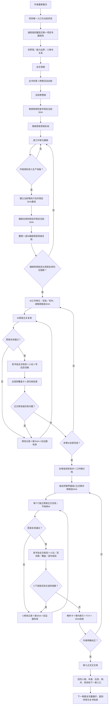

# AI 长篇小说自动审核与编写流程

技巧：常问AI：“严格按规则执行了吗？规则卡生成了吗？”

用周易八卦思维审核小说：不是占卜，而是从时位、进退、损益、变化、言行与留尽等角度，复审卷纲、细纲和正文，检查情节转折与走势是否自然。AINovelWorkflow支持短篇与严肃长篇。短篇可调用人物、大纲、场景细纲、语言和核验模板；长篇则串联母纲、年表、跨卷任务、逐W细纲、W正文、C正式章和卷终扶正。正文须经过SHA锁定、周易前置复核、老书虫全文审读、小白检查、双词典去AI腔、全规则覆盖和逐句核验；任何改文都会使旧证据失效并重新核验。新手可从`11_新手快速启动与轻量练习路径.md`进入，按5个核心文件完成练习稿，再升级正式流程。

技能与插件的发行安装包，Ai写小说skill压缩包，放在【99_来源与维护】中。

v1.4进一步锁死写前、写中、写后、每五W、正式章C和卷终的必需文件与固定目录：任一文件缺失、错放、为空、待核、SHA不一致或业务关联不完整，禁止提交验收。

v1.5补齐了真实使用中最容易卡住的三块：新手可以先选择“轻量练习稿／正式短篇／严肃长篇”，作者与AI可以用三种协作模式明确谁写、谁核、谁放行，规则冲突、时间线错位、误覆盖或越权写作则统一走可追溯的失败恢复链。轻量路径只服务练习稿，绝不能冒充正式验收。

v1.6.1加入并纠正周易思维三阶段闸门：卷纲与细纲在常规核验后复核；每个W成稿和每个C重组章则必须在老书虫全文章节核验前先锁候选SHA完成周易正文复核。后续任何核验只要改文，就对新SHA先重做周易，再从老书虫全文核验起完整重跑。

## v1.5新增能力

- [新手快速启动与轻量练习路径](00_模板库入口/11_新手快速启动与轻量练习路径.md)：给只想先写约3万字练习稿的新用户一条5文件最低路径，同时明确升级正式作品后必须补齐全套规则并从首章重核。
- [轻量练习项目卡](04_写作模板库/19_轻量练习项目卡模板.md)：用一张卡记录最小人物、故事运动、场景、连续性和写前／写中／写后检查；固定状态为“练习稿／未完成正式核验”。
- [常见协作模式配置](06_核验模板库/14_常见协作模式配置模板.md)：覆盖“作者主写AI只核验／单主写AI作者逐阶段放行／AI主写作者复核”，锁定主写窗口、允许文件、停止点、回写对象和作者最终扶正权。
- [失败模式与恢复手册](00_模板库入口/12_失败模式与恢复手册.md)：遇到规则冲突、重组矛盾、卷终时间线错误、规则中途升级、误删误覆盖、链接SHA异常或AI越权时，按“保存现场→证据失效→最后有效SHA→作者裁决→修复重核→恢复放行”处理。

## v1.6—v1.6.1新增能力

- [周易思维三阶段强制复核规则](01_通用规则库/10_周易思维三阶段强制复核规则.md)：把周易作为结构与人物选择的复审方法，不作占卜；每卷卷纲、整卷细纲、每个W细纲、每个W正文和每个C正式章都必须独立留证。
- [周易思维小说复核库](01_通用规则库/11_周易思维小说复核库.md)：提供时位、进退、损益、变化、言行、留尽等十八镜，以及人物九慎、六十四卦问题索引、主卡＋制衡卡，专门追问转折是否自然、代价是否真实、人物是否被作者强推。
- [周易思维三阶段复核卡](06_核验模板库/15_周易思维三阶段复核卡模板.md)：统一记录对象、当前SHA、触发问题、证据位置、修改意见、复核结论和失效状态；卷级汇总不能替代逐W、逐C对象卡。
- [Y1—Y6句子触发码](06_核验模板库/00_句子触发规则代码表.md)：把“时位错配、进退失据、损益失衡、变化无因、言行失真、留尽失当”接入逐句核验，但不能代替全文阅读和证据判断。
- v1.6.1纠正正文核验顺序：W成稿和C重组后先锁候选SHA做周易正文复核，通过后才进入老书虫全文章节核验；后续任何改文都会使周易卡及下游证据失效，必须对新SHA从周易重新起跑。

## 总流程图



## 它解决什么问题

- 新窗口凭聊天记忆直接续写，导致规则和事实漂移；
- 大纲、工作稿、正式章和合订TXT互相冒充权威版本；
- 人物瞬移、越权、越过身体限制或知道不该知道的信息；
- 对白像审讯记录，旁白像工作报告，禁词扫描却被当成去AI完成；
- 修改正文后继续沿用旧SHA、旧逐句表和旧“通过”结论；
- 文件虽然在Obsidian中可见，却没有真实业务链接和反向入口；
- 整卷没有作者明确扶正，就被误放进正式正文库。

## 快速开始

1. 下载或克隆本仓库。
2. 先完整阅读[模板库唯一入口](00_模板库入口/README_唯一入口.md)。
3. 再阅读[完整交接文档](00_模板库入口/10_通用模板库完整交接文档.md)。
4. 用[新手快速启动与轻量练习路径](00_模板库入口/11_新手快速启动与轻量练习路径.md)选择轻量练习、正式短篇或严肃长篇。
5. 轻量练习使用[轻量练习项目卡](04_写作模板库/19_轻量练习项目卡模板.md)，并始终保留“练习稿／未完成正式核验”状态。
6. 正式短篇或严肃长篇按[新小说初始化顺序](00_模板库入口/01_新小说初始化顺序.md)复制`03_新书项目骨架`，整层迁移规则、双词典和流程硬规则。
7. 完成作者裁决、人物设定、母纲、年表、卷纲和细纲后，再等待作者授权进入正文生产准备。
8. 每个工作单元成稿、每个正式章重组后，都先锁候选SHA完成周易正文复核，再执行老书虫全文核验、小白、双词典、全规则覆盖、逐句核验、改文失效和SHA验收。

在 Codex 中可以从下面这句话开始：

```text
请先完整读取00_模板库入口/README_唯一入口.md和10_通用模板库完整交接文档.md，只建立当前磁盘基线并回报；没有我的当前授权，不生成大纲、细纲或正文。
```

## 直接下载

- [Codex个人插件ZIP](99_来源与维护/发行包/Codex个人插件/ai-novel-workflow-codex-plugin.zip)：解压后根目录直接包含`.codex-plugin/plugin.json`，内置`novel-writing-template`技能。
- [扣子Skill ZIP](99_来源与维护/发行包/扣子Skill/novel-writing-template-coze.zip)：ZIP根目录直接包含`SKILL.md`和`references/`，用于扣子Skill导入。
- [AI执行Skill源文件](SKILL.md)：便于审阅强制预检、阶段路由和完成闸门。

两套发行物都从同一份公开、脱敏、最新模板库基线生成，但按平台规范分开打包。不要把扣子的额外frontmatter字段直接复制进Codex Skill，也不要继续使用旧ZIP中的过期引用。

## 目录

| 目录 | 用途 |
|---|---|
| `00_模板库入口` | 唯一入口、初始化、链路、逐卷流程和完整交接 |
| `01_通用规则库` | 所有长篇项目逐对象判断的通用规则 |
| `02_语言与风格库` | 对白、旁白、中文母语与去AI腔双词典 |
| `03_新书项目骨架` | 新项目固定目录与空白入口 |
| `04_写作模板库` | 母纲、年表、卷纲、细纲、执行和回写模板 |
| `05_人物与设定模板库` | 人物、关系、世界、研究和连续性台账 |
| `06_核验模板库` | 覆盖卡、逐句表、修改、卷终和扶正模板 |
| `07_工具脚本` | 哈希、逐句表、TXT、重组和链接机械检查 |
| `99_来源与维护` | 来源、版本、资产登记、SHA与验收证据 |
| `99_来源与维护/发行包` | Codex个人插件与扣子Skill两套独立发行物 |

## 重要边界

- 本库是可复用模板，不属于任何一本具体小说。
- 具体小说只复制模板，不把正文、人物、世界观或作者裁决反写进本库。
- 脚本只能检查结构、数量、哈希、链接和格式，不能自动判断文学质量。
- 快速草稿必须明确标记“未验收”；不得用快速模式、摘要或工具扫描伪造正式完成状态。
- 轻量练习稿不得直接升级为正式通过；转正式时必须补齐完整规则与资产，并从首章重新核验。
- 三种协作模式只分配执行责任，不能把作者扶正权交给AI。
- 发生冲突或误操作必须保留故障现场并走恢复链，不能静默改完继续写。
- 禁词没有命中不等于语言自然；必须实际执行对白、旁白专审和人工全文复读。
- 作者最新明确裁决高于模板，但必须落盘到项目专属规则。
- 没有作者明确扶正，不得把正文移入正式正文库。

## Obsidian

仓库可以直接作为Obsidian库打开。入口为[OBSIDIAN_库入口.md](OBSIDIAN_库入口.md)。公开发行版不包含个人工作区状态；Obsidian首次打开后会自动生成自己的`.obsidian`运行配置。

## 开源许可

本项目使用[MIT License](LICENSE)。你可以使用、复制、修改和分发，但请保留许可和版权声明。

## 文件关联

- 上游依据：[小说通用模板库唯一入口](00_模板库入口/README_唯一入口.md)、[完整交接文档](00_模板库入口/10_通用模板库完整交接文档.md)。
- 同层互证：[通用资产清单](00_模板库入口/08_通用资产清单.md)、[完整资产登记与缺口清单](00_模板库入口/09_完整资产登记与缺口清单.md)、[Codex个人插件发行包](99_来源与维护/发行包/Codex个人插件/README.md)、[扣子Skill发行包](99_来源与维护/发行包/扣子Skill/README.md)。
- 下游使用：[新小说初始化顺序](00_模板库入口/01_新小说初始化顺序.md)、[每卷严格生产流程](00_模板库入口/03_每卷严格生产流程.md)。
- 版本与验收：[来源与维护](99_来源与维护/README_来源与维护.md)、[通用模板库验收报告](99_来源与维护/02_通用模板库验收报告.md)。
